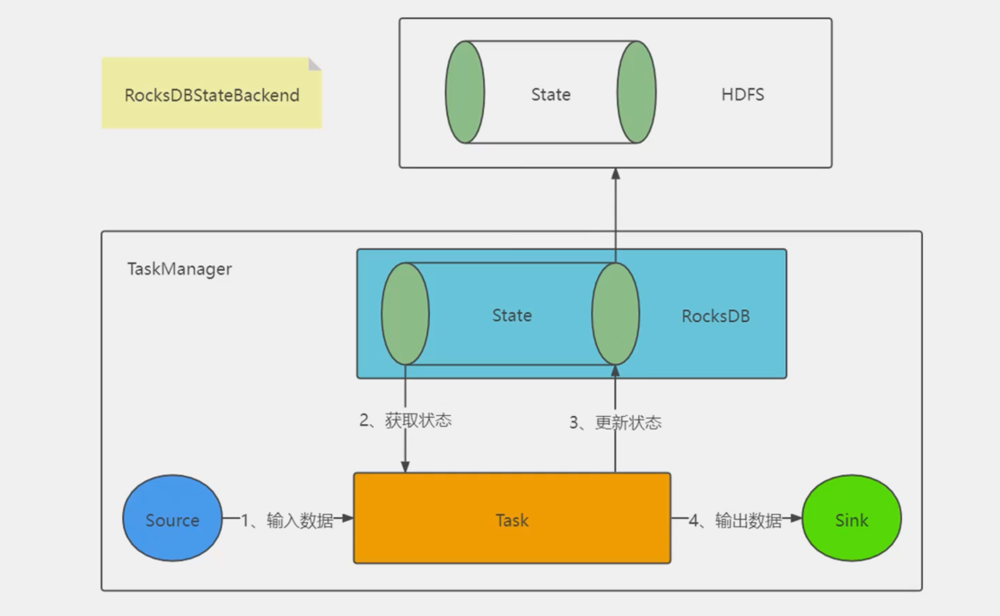

# flink-sourcecode-learning

flink源码学习

### partitioner

#### streaming

##### rescale

伸缩

##### rebalance

Round-robin 轮训

##### KeyBy

根据字段来进行hash分区, 相同的Key必须在统一分区内  
按照指定的key来做hash

* MR分为两个阶段, 第一个Mapper阶段, 提取待计算的数据, 打上标记Key
* MR分为两个阶段, 第二个Reducer阶段, 获取到了Key相同的一组待计算的数据, 进行聚合计算

##### global

所有输出的数据, 都发送给下游第一个Task


> 会出现反压的问题

##### forward

同一节点的上游task直接给下游task(没有网络IO)

* 可能出现多个上游, 一个下游(出现节点压力激增)

> 本身`forward` 是一种非常高效的方式
> 上下游两个Operator之间能否连成OperatorChain有9个条件

##### shuffle

随机分布, 根据均匀分布随机分配元素

##### broadcast

广播, 向每个分区广播元素, 把所有元素广播到所有分区

### 状态管理 state

#### KeyState

在做KeyBy之后, 每个Key都会携带一个状态, 这个状态就叫做KeyState

##### ValueState

单个值

* Integer
* String
* Tuple10
* 自定义类

##### ListState

多个值(List)

##### MapState

Key-value类型的值

> 区别就在于, 怎么去用`Value`, `List`, `Map`这种数据结构来存储状态  
> 一个Key 一个ListState或者ValueState或者MapState  
> e.g. Map<Key, MapState<String,Long>>  stateContainer就是一个task的所有状态数据  
> 如果突然某个时刻这个Task死掉了, stateContainer就丢失了  
> 如果要数据有且仅有被处理一次, 必然要持久化状态`CheckPoint`

##### ReducingState

聚合逻辑, 是AggregatingState的一种特例  
`oldState+input=newState`

##### AggregatingState

聚合逻辑

#### 根据状态划分

##### 托管状态

由Flink框架管理的状态, 我们通常使用的就是这种

##### 原始状态

由用户自行管理具体的数据结构

#### OperatorState

一个Task一个State. 一般来说, OperatorState编码过程中使用很少


* 4个分区, 并行度就为4
* Flink Application 的Source Operator的并行度就是4, 一般不会设置多, 也不会设置少
* 每个SourceTask必然要去记录当前task消费到当前partition的哪个offset
    * 就是把所有的SourceTask的状态OperatorState进行持久化
* Flink + Kafka 整合
    * 记录当前应用程序消费Topic的每个分区的offset
    * FLink的Application的SInk操作必须输出的时候确保数据一致性(确保数据消费语义有且仅有一次)
        * 幂等输出
        * 2PC两阶段分布式事务提交

> 并不是所有的计算都是有状态的, 也有一些计算类型是无状态的(KeyState)的, 大写转小写, 比如ETL  
> 累加器? 不能实现! 不停的加, `Metric`也是加, 不能实现. 因为累加器和Metric都没有恢复的能力

> flatmap 和 map能做一样的事儿, 为什么还要搞一个`flatmap`  
> 有了A和B, 但毕竟A和B还是在功能上有差别的, 那么A和B都合理

### 7x24 不间断流式计算


计算的分类

* 无状态的计算: 大写转小写, ETL处理
* 有状态的计算: sum, distinct

#### Flink 容错架构设计

1. StateBackend 深入剖析与应用
2. StateBackend 原理剖析及实践
3. Checkpoint 容错机制原理概述
4. Checkpoint 算法原理深入剖析
5. Chandy-Lamport算法
6. Checkpoint 源码级配置详解
7. SavePoint企业生产实践方案
8. (Job)RestartStrategy重启策略和(Task)FailoverStrategy故障转移策略

> 整合起来三个部分, 共同联合保证flink的容错  
> State和StateBackend  
> CheckPoint和Chandy-Lamport  
> Job和我Task的策略

#### StateBackend

> 淘汰掉原来三种实现, 提供两种新的实现的目的: 为了统一接口! (底层原理没变) window变成也被统一了, Time变成也被统一了.

> 策略模式

配置:

* state.backend: hashmap

| 实现支持 | MemoryStateBackend <br/> HashMapStateBackend | FsStateBackend <br/> HashMapStateBackend | RocksDBStateBackend <br/> EmbededRocksDBStateBackend |
|------|----------------------------------------------|------------------------------------------|------------------------------------------------------|
| 代号   | jobmanager<br/>hashmap | filesystem <br/> hashmap | rocksdb|
| Task State | TaskManager堆内存中 | TaskManager 堆内存中 | TaskManager中的RocksDB 实例中 |
| JobState | JobManager 堆内存中<br/> hashmap的话基于 CheckpointStorage 来定 | 外部高可用文件系统, 比如 HDFS <br/> hashmap的话基于CheckpointStorage来定 | 外部高可用文件系统, 比如HDFS |
| 缺点 | 只能保存数据量较少的状态<br/> 状态数据有可能丢失 | 状态大小受TaskManager内存限制(默认5M) | 访问速度有所下降 |
| 优点 | 开发测试很方便 <br/> 性能好 | 状态访问速度很快<br/> 状态信息不会丢失 | 可以存储超大量的状态信息 <br/> 状态信息不会丢失 |

(细粒度) TaskState: 一个Application会运行很多的Task, 每个Task运行的时候, 都有自己的状态, 故障转移=FailOver
* 要么是TaskManager的堆内存中
* 要么是RocksDB实例中  


(粗粒度) Job State: 在某个时候, 通过某种手段(checkpoint), 把这个job的所有的Task的state做一个持久化, 就形成了job的state
* 要么JobManager堆内存中
* 要么是HDFS


##### MemoryStateBackend


#####   

#####   



```text
state.backend的值

1. jobmanager(MemoryStateBackend)
2. filesystem(FsStateBackend)
3. rocksdb(RocksDBStateBackend)
```

MemoryStateBackend(老版本的默认实现)和FsStateBackend的代码写法